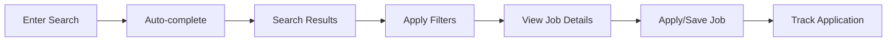

# Business Documentation - Semantic Job Search Platform

## 📋 Table of Contents

1. [Platform Overview](#platform-overview)
2. [Business Logic & Architecture](#business-logic--architecture)
3. [Data Sources](#data-sources)
4. [Search & Ranking Algorithm](#search--ranking-algorithm)
5. [User Journey & Experience](#user-journey--experience)
6. [Admin Operations](#admin-operations)
7. [Data Flow & Processing](#data-flow--processing)
8. [Content Quality & Moderation](#content-quality--moderation)

---

## 🌟 Platform Overview

### Mission Statement
Provide the most comprehensive and intelligent job search experience in Vietnam through semantic search technology that understands intent, not just keywords.

### Core Value Proposition
- **Semantic Understanding**: Find jobs by meaning, not just keyword matching
- **Comprehensive Coverage**: Aggregate jobs from multiple major Vietnamese job boards
- **Real-time Data**: Fresh job postings with automated daily updates
- **Quality Curation**: Intelligent duplicate detection and content filtering

### Target Market
- **Primary**: Vietnamese tech professionals and job seekers
- **Secondary**: International professionals seeking opportunities in Vietnam
- **Admin Users**: HR professionals and recruitment agencies

---

## 🏗️ Business Logic & Architecture

### Core Business Rules

#### Job Processing Pipeline
1. **Data Ingestion**: Automated crawlers collect job postings from partner sites
2. **Quality Filtering**: Remove incomplete, duplicate, or expired postings
3. **Semantic Indexing**: Generate vector embeddings for intelligent search
4. **Real-time Availability**: Jobs searchable within minutes of discovery

#### Search Intelligence
- **Intent Recognition**: Understand user intent beyond literal keywords
- **Contextual Matching**: Consider job requirements, skills, and experience levels
- **Relevance Scoring**: Multi-factor ranking including recency, popularity, and semantic match
- **Progressive Results**: Show most relevant results first, allow refinement

#### User Experience Principles
- **Speed First**: Sub-second search response times
- **Privacy Focused**: No personal data collection without explicit consent
- **Mobile Optimized**: Responsive design for all device types
- **Accessibility**: WCAG compliant interface design

### System Requirements

#### Performance Requirements
- **Response Time**: Sub-second search response times for optimal user experience
- **Availability**: 99.9% uptime with automated failover capabilities
- **Scalability**: Handle 10,000+ concurrent users and 100,000+ job postings
- **Data Freshness**: Jobs available for search within 5 minutes of discovery

#### Integration Requirements
- **Multi-source Aggregation**: Seamlessly combine data from multiple job boards
- **Real-time Processing**: Automated data ingestion and processing pipeline
- **Search Intelligence**: Advanced semantic search with contextual understanding
- **Quality Assurance**: Automated duplicate detection and content validation

---

## 📊 Data Sources

### Supported Job Boards

#### 1. TopCV (🟢 **ACTIVE**)
- **URL**: [topcv.vn](https://www.topcv.vn)
- **Market Share**: ~40% of Vietnamese tech jobs
- **Implementation**: ✅ **Playwright-based crawler (PRODUCTION READY)**
- **Update Frequency**: Daily at 00:00 and 12:00 UTC
- **Job Volume**: 200+ active positions
- **Data Quality**: High - structured job postings with complete metadata

**Crawler Specifications**:
- Base URL: https://www.topcv.vn/viec-lam/tat-ca-viec-lam
- Pagination: Query parameter based navigation
- Rate Limiting: 2-second delays between requests for server respect
- Error Handling: Retry mechanism with exponential backoff
- Data Fields: Title, company, location, salary, description, requirements

#### 2. ITViec (🟡 **PLANNED**)
- **URL**: [itviec.com](https://itviec.com)
- **Market Share**: ~30% of Vietnamese tech jobs
- **Implementation**: 🔄 **Mock implementation - NEEDS REAL CRAWLER**
- **Target Volume**: 150+ positions expected
- **Specialization**: Tech and IT jobs specifically

**Development Requirements**:
- Implement automated crawler for ITViec job listings
- Support ITViec's job listing structure and pagination
- Include appropriate rate limiting and error handling
- Ensure data quality standards are maintained

#### 3. VietnamWorks (🟡 **PLANNED**)
- **URL**: [vietnamworks.com](https://www.vietnamworks.com)
- **Market Share**: ~25% of Vietnamese job market
- **Implementation**: 🔄 **Mock implementation - NEEDS REAL CRAWLER**
- **Target Volume**: 100+ positions expected
- **Specialization**: Broad job market including non-tech roles

**Development Requirements**:
- Implement automated crawler for VietnamWorks job listings
- Support their job listing structure and pagination
- Include appropriate rate limiting and error handling
- Ensure broad job market coverage beyond tech roles

#### 4. LinkedIn Jobs (🔴 **RESEARCH PHASE**)
- **URL**: [linkedin.com/jobs](https://www.linkedin.com/jobs)
- **Market Share**: ~20% (growing rapidly)
- **Implementation**: 🔍 **Research phase - COMPLEX**
- **Challenges**: Anti-bot measures, potential API requirements
- **Target Volume**: 50+ positions expected

**Research Requirements**:
- Investigate LinkedIn's terms of service and data access policies
- Evaluate official API options versus web scraping approaches
- Assess legal and technical feasibility for data collection
- Design appropriate authentication and access management

### Data Source Management

#### Source Configuration Requirements
- Unique identifier and display name for each job board
- Base URL and API endpoint specifications
- Status tracking (active, inactive, maintenance mode)
- Crawl frequency and scheduling configuration
- Health monitoring and success rate tracking
- Job volume and data completeness metrics

#### Quality Metrics
- **Success Rate**: Percentage of successful crawl attempts
- **Data Completeness**: Required fields populated per job
- **Duplicate Rate**: Percentage of duplicate jobs detected
- **Freshness Score**: Average age of job postings

#### Monitoring & Alerts
- Real-time crawler status monitoring
- Automated alerts for crawler failures
- Daily health reports for each data source
- Performance metrics tracking and analysis

---

## 🔍 Search & Ranking Algorithm

### Semantic Search Technology

#### Vector Embedding Process
1. **Text Processing**: Clean and normalize job descriptions and titles
2. **Embedding Generation**: Convert text to high-dimensional vectors using Marqo
3. **Index Storage**: Store vectors in optimized search index
4. **Query Processing**: Convert user queries to vectors for similarity matching

#### Ranking Factors
1. **Semantic Similarity** (40%): Vector distance between query and job
2. **Recency** (25%): Favor recently posted jobs
3. **Popularity** (20%): Track clicks and application rates
4. **Completeness** (10%): Prefer jobs with complete information
5. **Source Authority** (5%): Weight based on source reliability

#### Search Features
- **Auto-complete**: Suggest queries as users type
- **Related Searches**: Show similar or refined search options
- **Filters**: Location, salary range, experience level, job type
- **Sort Options**: Relevance, date, popularity, salary

### Query Processing Pipeline

#### 1. Query Analysis Process
- Normalize and clean user input text
- Extract location entities (Ho Chi Minh, Hanoi, Da Nang, etc.)
- Identify skill keywords (programming languages, frameworks, tools)
- Detect experience level indicators (junior, senior, lead, manager)
- Parse salary expectations and job type preferences

#### 2. Semantic Matching Process
- Generate query embeddings using vector analysis
- Search indexed job embeddings for similarity matches
- Apply business logic filters (location, salary, experience)
- Rank results using multi-factor scoring algorithm

#### 3. Result Enhancement Process
- Add similarity scores and match explanations
- Include related job suggestions and recommendations
- Generate search insights and market statistics
- Apply personalization based on user preferences (when available)

---

## 👤 User Journey & Experience

### Public User Flow

#### 1. Job Discovery
- **Landing Page**: Hero search with popular categories
- **Search Results**: Paginated, filterable job listings
- **Job Details**: Complete job information with apply links
- **Similar Jobs**: ML-powered recommendations

#### 2. Search Experience

#### 3. Mobile Experience
- **Responsive Design**: Optimized for all screen sizes
- **Touch-friendly**: Large buttons and easy navigation
- **Fast Loading**: Optimized images and progressive loading
- **Offline Support**: Cache recent searches and results

### Future User Features (Planned)

#### User Authentication
- **Registration**: Email/social login options
- **Profile Management**: Skills, experience, preferences
- **Job Tracking**: Save jobs, track applications
- **Personalization**: Customized search results and recommendations

#### Advanced Features
- **Job Alerts**: Email/SMS notifications for matching jobs
- **Resume Upload**: Parse and match skills automatically
- **Application Tracking**: Monitor application status across platforms
- **Career Insights**: Salary trends, skill demand analysis

---

## 🛠️ Admin Operations

### Admin Dashboard Features

#### 1. System Overview
- **Live Statistics**: Active jobs, search volume, crawler status
- **Health Monitoring**: Database, search engine, crawler health
- **Performance Metrics**: Response times, error rates, uptime
- **Usage Analytics**: Popular searches, user behavior patterns

#### 2. Content Management
- **Job Viewing**: Access complete job details and metadata
- **Job Editing**: Update job information and correct inaccuracies
- **Job Deletion**: Remove inappropriate or outdated postings
- **Job Featuring**: Promote high-quality jobs for better visibility
- **Job Hiding**: Temporarily remove jobs from search results
- **Job Approval**: Manual review and approval for quality control

#### 3. Crawler Management
- **Manual Triggers**: Start crawlers on-demand
- **Configuration Updates**: Modify crawler settings without deployment
- **Error Investigation**: Detailed logs and error analysis
- **Performance Tuning**: Adjust crawl frequency and rate limits

#### 4. User Management (Future)
- **User Accounts**: View and manage user registrations
- **Access Control**: Role-based permissions and restrictions
- **Usage Monitoring**: Track user activity and API usage
- **Support Tools**: Help users with account and technical issues

### Operational Procedures

#### Daily Operations
1. **Morning Health Check**: Review overnight crawler results
2. **Data Quality Review**: Check for unusual patterns or issues
3. **Performance Monitoring**: Ensure response times within SLA
4. **User Support**: Address any reported issues or feedback

#### Weekly Operations
1. **Deep Analytics Review**: Analyze search trends and user behavior
2. **Crawler Optimization**: Adjust settings based on performance data
3. **Content Audit**: Review and clean low-quality job postings
4. **System Updates**: Deploy new features and security patches

#### Monthly Operations
1. **Business Review**: Analyze growth metrics and KPIs
2. **Technical Debt**: Address accumulated technical issues
3. **Capacity Planning**: Scale infrastructure based on usage growth
4. **Competitive Analysis**: Monitor market changes and opportunities

---

## 📈 Data Flow & Processing

### Real-time Data Pipeline

#### 1. Data Ingestion Process
- Fetch job listings from partner websites and APIs
- Parse structured and unstructured job posting data
- Extract and normalize job information fields
- Validate required fields and ensure data quality standards
- Prepare cleaned data for further processing and indexing

#### 2. Data Processing Pipeline
- Duplicate detection using advanced content similarity analysis
- Data normalization and standardization across sources
- Semantic embedding generation for intelligent search
- Quality scoring and automated filtering
- Database storage and search index updates

#### 3. Search Index Updates
- Generate vector embeddings for semantic search capabilities
- Update search index with new and modified job data
- Refresh auto-complete suggestions and search hints
- Update related job recommendations and suggestions
- Clear relevant search result caches for optimal performance

### Data Quality Assurance

#### Validation Rules
1. **Required Fields**: Title, company, location, description
2. **Data Formats**: Consistent date formats, salary ranges
3. **Content Length**: Minimum description length for quality
4. **Language Detection**: Filter non-Vietnamese/English content
5. **Spam Detection**: Identify and filter promotional content

#### Monitoring Metrics
- **Data Completeness**: Percentage of jobs with all required fields
- **Processing Speed**: Time from crawl to searchable
- **Error Rates**: Failed processing attempts per source
- **Quality Scores**: Automated content quality assessment

---

## 🔒 Content Quality & Moderation

### Automated Quality Control

#### Duplicate Detection Logic
- Compare job titles using fuzzy matching algorithms
- Analyze company name similarity and variations
- Evaluate job description content overlap and similarity
- Consider location and salary range compatibility
- Generate combined similarity scores for decision making

#### Content Filtering
- **Spam Detection**: Machine learning models to identify spam content
- **Language Processing**: Natural language processing for content quality
- **Image Analysis**: Scan for inappropriate or promotional images
- **Link Validation**: Verify job application links are legitimate

### Manual Moderation Tools

#### Admin Review Queue
- **Flagged Content**: Jobs flagged by automated systems or users
- **Quality Review**: Random sampling for quality assurance
- **Batch Operations**: Approve, reject, or modify multiple jobs
- **Moderation History**: Track all moderation actions and decisions

#### Community Reporting
- **User Reports**: Allow users to flag inappropriate or incorrect content
- **Feedback System**: Collect user feedback on job quality and relevance
- **Continuous Improvement**: Use reports to improve automated detection

### Data Governance

#### Privacy Compliance
- **Data Minimization**: Collect only necessary job information
- **Retention Policies**: Automatic removal of expired job postings
- **User Rights**: Support data access and deletion requests
- **Audit Trails**: Comprehensive logging of all data operations

#### Content Policies
- **Acceptable Content**: Clear guidelines for job posting quality
- **Prohibited Content**: Explicit rules against discriminatory or misleading posts
- **Source Verification**: Ensure all job sources are legitimate platforms
- **Update Procedures**: Regular review and updates of content policies

---

## 📞 Contact & Support

### Technical Support
- **Documentation**: Comprehensive API and user documentation
- **Issue Tracking**: GitHub issues for bug reports and feature requests
- **Response Time**: 24-hour response for critical issues
- **Knowledge Base**: Self-service troubleshooting guides

### Business Inquiries
- **Partnership Opportunities**: Integration with additional job boards
- **API Access**: Enterprise API access for third-party integrations
- **Custom Solutions**: Tailored search solutions for enterprise clients
- **Data Licensing**: Access to aggregated job market data and insights

---

**Last Updated**: August 5, 2025  
**Document Version**: 1.0  
**Next Review**: Monthly business review process
